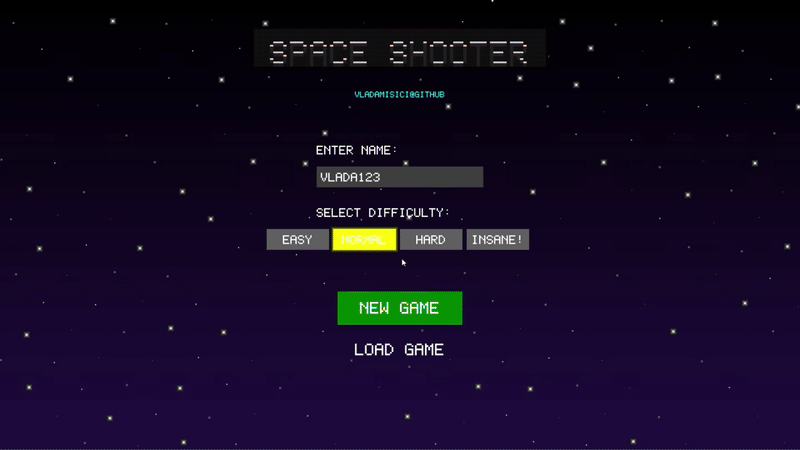

# Space Shooter



A fullscreen, Win64 assembly space shooter with custom software-rendered graphics, starfields, asteroids, aliens, dash ability and level progression.

## Build

```sh
nasm -f win64 space_shooter.asm -o space_shooter.obj
golink /entry:Start kernel32.dll user32.dll gdi32.dll space_shooter.obj
```

For console-debug output:

```sh
golink /entry:Start /console kernel32.dll user32.dll gdi32.dll space_shooter.obj
```

## Requirements

- Windows x64
- NASM
- GoLink 


## Usage

1. Run the generated `space_shooter.exe`.
2. Enter your name at the menu.
3. Select difficulty (Easy / Normal / Hard / Insane).
4. **New Game** or **Load Game**.
5. Navigate levels in the constellation map.
6. Earn points by blasting aliens (10 pts) and asteroids (25 pts).

## Controls

- ← → ↑ ↓ — Move
- **SPACE** — Shoot
- **SHIFT** — Dash (3 sec dash, 10 sec cooldown)
- **ESC** — Back to menu / exit
- **Enter** — Confirm menu

## Features

- 60 FPS timer-based main loop  
- Custom 5×7 pixel font  
- Software-drawn DIB framebuffer  
- Animated title, starfield & HUD  
- Persistent save (`spaceshooter.sav`)  
- 5 galaxies × 10 levels each  
- In-game save/load & level completion tracking  

## Author

vladamisici – [github.com/vladamisici](https://github.com/vladamisici)
